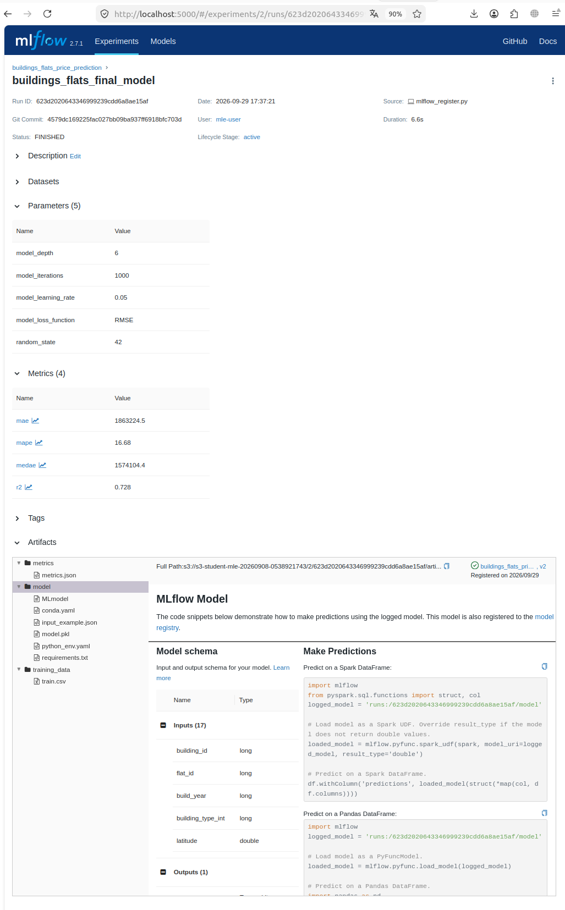
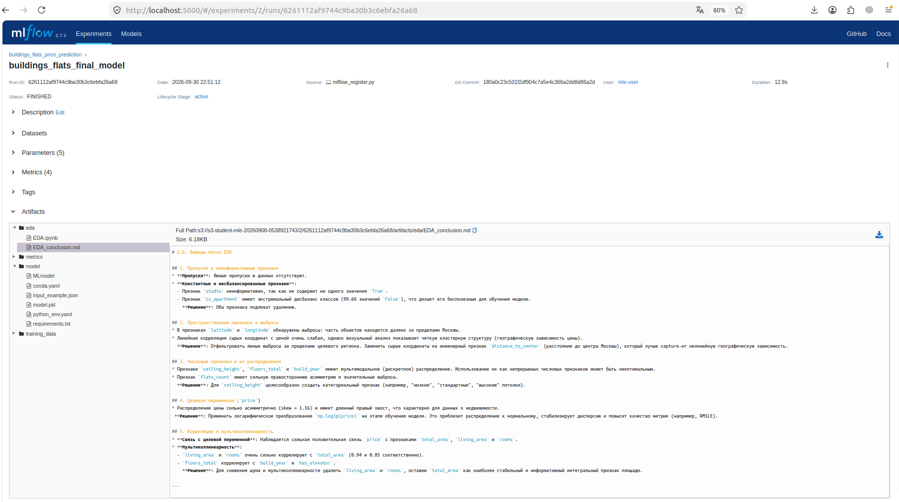

# Проект "Улучшение baseline-модели"

## О проекте

Репозиторий содержит решение проекта 2 спринта: улучшение baseline модели для прогнозирования стоимости квартир Яндекс Недвижимости.

## Хранилище артефактов

**Имя бакета:** `s3-student-mle-20260908-0538921743`

Endpoint: `https://storage.yandexcloud.net`

Чтобы проверить артефакты, выполните `dvc pull` в директории `part2_dvc/` —
будут скачаны датасеты (`data/*.csv`) и обученная модель
(`models/fitted_model.pkl`).

---

## Этап 1. Разворачивание MLflow Tracking Server и MLflow Model Registry. Регистрация существующей модели.

### 1.1. Настройка окружения

Для работы используются два независимых `.env`-файла:

1. **`.env` для MLflow-сервера** — инфраструктурные параметры (БД, S3).
2. **`.env` для регистрации модели** — параметры подключения к MLflow и имена сущностей.

#### `.env` для MLflow-сервера

Скопируйте шаблон переменных окружения и заполните его своими значениями:

```bash
cp mlflow_server/mlflow_env_template mlflow_server/.env
```

В `.env` должны быть заданы следующие переменные:

| Переменная | Назначение |
|---|---|
| `MLFLOW_S3_ENDPOINT_URL` | Адрес S3-совместимого хранилища для артефактов |
| `AWS_ACCESS_KEY_ID` | Ключ доступа к S3 |
| `AWS_SECRET_ACCESS_KEY` | Секретный ключ S3 |
| `S3_BUCKET_NAME` | Имя бакета для артефактов |
| `DB_DESTINATION_USER` | Пользователь БД (backend store) |
| `DB_DESTINATION_PASSWORD` | Пароль БД |
| `DB_DESTINATION_HOST` | Хост БД |
| `DB_DESTINATION_PORT` | Порт БД |
| `DB_DESTINATION_NAME` | Имя базы данных |
| `EXPERIMENT_NAME` | Имя эксперимента в MLflow |
| `MODEL_NAME` | Имя регистрируемой модели |
| `MLFLOW_URI` | URI MLflow-сервера (по умолчанию `http://localhost:5000`) |

#### `.env` для регистрации модели

```bash
cp mlflow_server/registrate_env_template .env
```

В этом `.env` указываются только параметры, необходимые скрипту `mlflow_register.py`:

| Переменная | Обязательность | Значение по умолчанию | Назначение |
|---|---|---|---|
| `EXPERIMENT_NAME` | опционально | `buildings_flats_price_prediction` | Имя эксперимента в MLflow, в который логируется run |
| `MODEL_NAME` | опционально | `buildings_flats_price_model` | Имя регистрируемой модели в MLflow Model Registry |
| `MLFLOW_URI` | опционально | `http://localhost:5000` | URI MLflow-сервера (tracking URI) |

> Переменные `EXPERIMENT_NAME`, `MODEL_NAME` и `MLFLOW_URI` имеют значения по умолчанию в коде, поэтому `.env` для регистрации модели можно не создавать, если используются дефолтные значения. Однако при работе с удалённым MLflow или другим именем эксперимента/модели — файл обязателен.

#### Зависимости

Установите зависимости:

```bash
pip install -r requirements.txt
```

### 1.2. Запуск MLflow-сервера

Скрипт для поднятия MLflow-сервисов: [`mlflow_server/run_mlflow_server.sh`](mlflow_server/run_mlflow_server.sh)

Скрипт выполняет:
- загрузку переменных из `.env`;
- экспорт переменных для доступа к S3;
- запуск `mlflow server` с backend-store в PostgreSQL и artifact-root в S3.

Запуск:

```bash
cd mlflow_server
./run_mlflow_server.sh
```

После запуска MLflow UI доступен по адресу `http://localhost:5000`.

### 1.3. Регистрация модели:

Скрипт регистрации модели: [`mlflow_server/scripts/mlflow_register.py`](mlflow_server/scripts/mlflow_register.py)

Скрипт выполняет:
- загрузку `.env` (параметры подключения к MLflow);
- подключение к MLflow и установку эксперимента;
- загрузку параметров из `params.yaml`;
- загрузку обученной модели из `models/fitted_model.pkl`;
- загрузку обучающих данных и метрик валидации;
- логирование параметров, метрик и артефактов;
- регистрацию модели под именем `MODEL_NAME`.

Запуск:

```bash
python mlflow_server/scripts/mlflow_register.py
```

После успешного выполнения в консоль выводятся `Run ID` и имя зарегистрированной модели.

### 1.4. Эксперимент в MLflow

- **ID эксперимента:** `623d2020643346999239cdd6a8ae15af`
- **Название эксперимента:** `buildings_flats_price_prediction`

Ссылка на эксперимент в MLflow UI:

```
http://localhost:5000/#/experiments/2/runs/623d2020643346999239cdd6a8ae15af
```



## Этап 2. Проведение исследовательского анализа данных и логирование Jupyter Notebook с EDA в MLflow.

### 2.1. Ключевые шаги и выводы EDA

**Проведенный анализ:**
* Проверка пропусков и распределений признаков
* Анализ выбросов и мультиколлинеарности
* Исследование целевой переменной

**Ключевые выводы:**

1. **Неинформативные признаки**: Выявлены признаки `studio` (константный) и `is_apartment` (99.6% дисбаланс), которые не несут полезной информации для модели.

2. **Географические выбросы**: Обнаружены объекты за пределами Москвы по координатам. Сырые координаты имеют слабую линейную связь с ценой, но четкую кластерную структуру.

3. **Распределения признаков**: Признаки `ceiling_height`, `floors_total`, `build_year` имеют мультимодальное распределение. `flats_count` демонстрирует сильную асимметрию.

4. **Целевая переменная**: `price` имеет асимметричное распределение (skew=1.16) с длинным правым хвостом, что требует логарифмического преобразования.

5. **Мультиколлинеарность**: Высокая корреляция между `total_area`, `living_area` и `rooms` (0.85-0.94).

**Принятые решения по предобработке:**
- Удаление неинформативных признаков (`studio`, `is_apartment`)
- Фильтрация географических выбросов
- Создание инженерных признаков: `distance_to_center`, `is_first_floor`, `is_last_floor`
- Категоризация `ceiling_height`
- Удаление коррелирующих признаков (`living_area`, `rooms`)
- Логарифмическое преобразование целевой переменной

### 2.2. Логирование артефактов в MLFlow

Артефакты: 
* [`model_improvement/notebook.ipynb`](model_improvement/notebook.ipynb) - Jupyter Notebook с проведенным EDA;
* [`model_improvement/EDA_conclusion.md`](model_improvement/EDA_conclusion.md) - Markdown-файл с выводами по проведенному EDA.

Для логирования артефактов был доработан скрипт регистрации модели: [`mlflow_server/scripts/mlflow_register.py`](mlflow_server/scripts/mlflow_register.py).

**Результат**:



## Этап 3. Генерация признаков и обучение модели

### Выполненные шаги

**Предобработка и генерация признаков:**

Ручная генерация. На основе EDA были созданы новые признаки:

* `is_first_floor`, `is_last_floor`: Бинарные признаки, указывающие на расположение квартиры на первом или последнем этаже.

* `distance_to_center`: Расстояние от объекта до центра Москвы (по формуле Haversine), которое заменило исходные latitude и longitude.

* Автоматическая генерация: Для автоматического создания и отбора признаков был применён AutoFeatRegressor. Он сгенерировал 18 новых признаков, в основном представляющих собой нелинейные комбинации исходных (`total_area`, `kitchen_area`, `distance_to_center`), такие как `1/(kitchen_area*total_area)`, `sqrt(distance_to_center)/kitchen_area` и другие.

* Интеграция в пайплайн: Все преобразования, включая StandardScaler, PolynomialFeatures, KBinsDiscretizer, OneHotEncoder и AutoFeatRegressor, были объединены в единый ColumnTransformer и упакованы в sklearn.Pipeline.

**Обучение и оценка новой модели:**

Новая модель CatBoostRegressor была обучена на обогащенном наборе данных.

Целевая переменная `price` была предварительно логарифмирована с помощью `np.log1p` для стабилизации дисперсии.

Метрики новой модели:

* MAE: 2 106 159.7 руб.
* MAPE: 18.13%
* R^2: 0.629

Производительность:

* Время обучения: ~2 мин. (включая время на генерацию признаков autofeat).
* Время предсказания: ~0.3 сек.

**Логирование в MLflow:**

Все артефакты (пайплайн, ноутбук с EDA, метрики) были залогированы в MLflow.

Название запуска (Run Name): v2_autofeat_pipeline_model

Зарегистрированная модель: buildings_flats_price_model (создана новая версия v4).

### Анализ и выводы:

Несмотря на комплексный подход к генерации признаков, новая версия модели показала ухудшение качества 
по сравнению с базовой:

| Метрика | Базовая модель (learn_baseline.ipynb) | Новая модель (notebook.ipynb) | Изменение |
|---|---|---|---|
| MAE | 1 863 224,51 руб | 2 106 081,78 руб | Ухудшение |
| MAPE | 16,68% | 18,13% | Ухудшение |
| R² | 0,73 | 0,63 | Ухудшение |